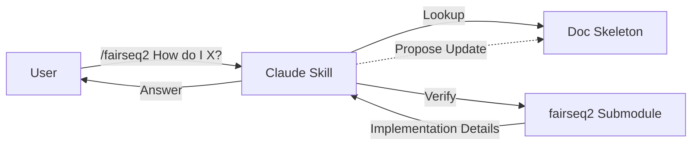

# fairseq2 Claude Skill

An assistant for fairseq2 that bridges high-level documentation with your local installed code (e.g. in site-packages in your activated venv).



- [RFC & Feedback (Google Doc)](https://docs.google.com/document/d/1_UNFqiGNz7fjvSmlhNpgDY8Ei3Hg3zSQs7FgNm0c_dE/edit?usp=sharing) - Please leave comments and feedback here!
- [Mermaid Diagram Arch](https://www.internalfb.com/mermaid/MM34004)
- [Excalidraw Diagram Arch Design](https://www.internalfb.com/excalidraw/EX665803)

## Installation

Copy this directory to your skills folder:

```
cp -r skills/fairseq2 ~/.claude/skills/
```

## Usage

Start a chat with Claude (`claude`). This skill activates when you ask about `fairseq2` or `fs2`.

It will:

1. Check your local fs2 installation (e.g. in `site-packages` in your venv) to find the exact installed version of `fairseq2`.
2. Use the local `docs/` folder for high-level architectural concepts.
3. Flag any discrepancies between the documentation and your actual code ("Self-Evolving Docs").
