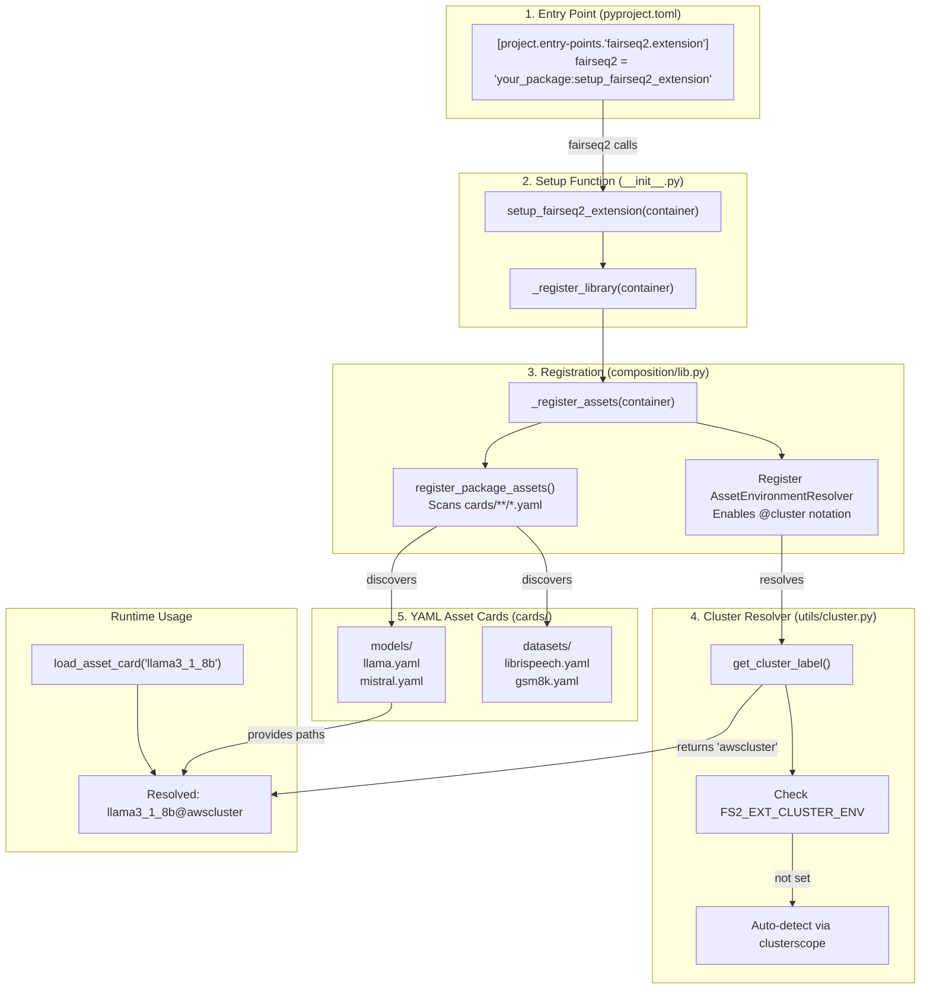
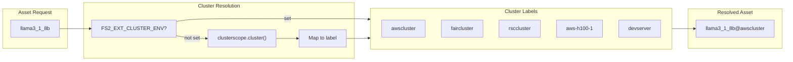
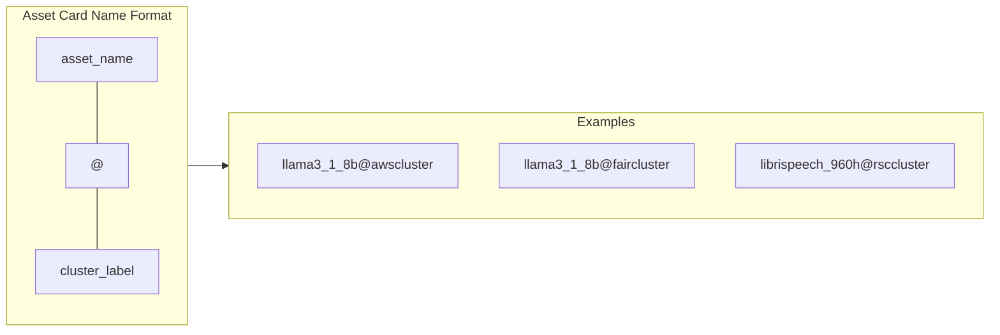
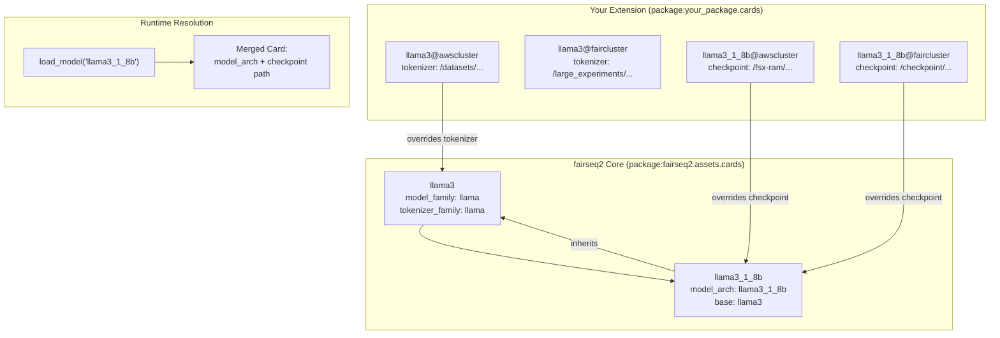
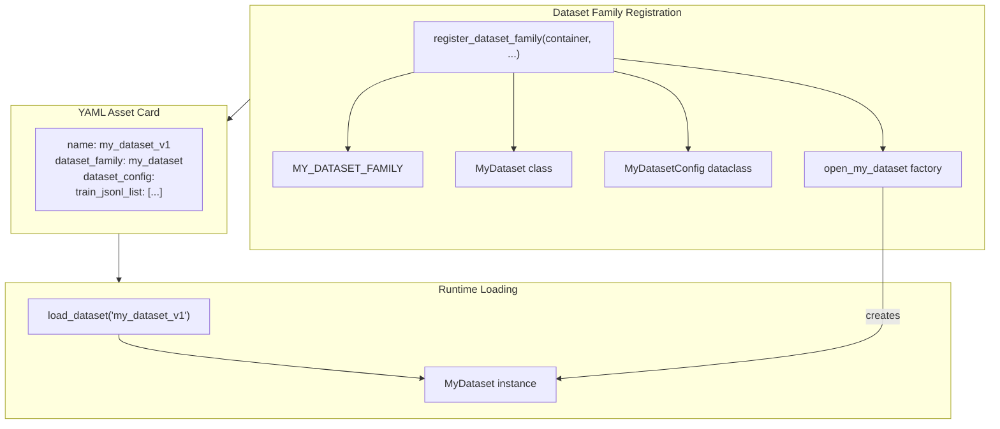

# Extending fairseq2 for Asset Management

**Status**: This is the **authoritative guide** for creating fairseq2 extensions. Other docs reference this as source of truth.

This guide explains how to extend fairseq2's asset management system to register custom models, datasets, and other assets in your package. The fairseq2 extension mechanism allows you to define asset configurations as YAML "asset cards" and programmatically register them for automatic discovery across different compute environments (clusters).

> **Reference Implementation**: See [fairseq2-ext](https://github.com/fairinternal/fairseq2-ext) for a complete working example.

## Overview

The fairseq2 extension system (v0.5+) consists of these main components:



### Key Components

| Component | Purpose | Location |
|-----------|---------|----------|
| **Entry Point** | Declares extension to fairseq2 | `pyproject.toml` |
| **Setup Function** | Initializes extension, calls registration logic | `__init__.py` |
| **Registration Library** | Registers assets and environment resolvers | `composition/lib.py` |
| **YAML Asset Cards** | Environment-specific asset definitions | `cards/**/*.yaml` |
| **Cluster Resolver** | Resolves current cluster for `@cluster` notation | `utils/cluster.py` |

## Step-by-Step Guide

### Step 1: Register the Entry Point

In your `pyproject.toml`, register your package as a fairseq2 extension:

```toml
[project.entry-points."fairseq2.extension"]
"fairseq2" = "your_package:setup_fairseq2_extension"
```

This tells fairseq2 to call `setup_fairseq2_extension()` from your package when initializing.

Ensure your YAML asset cards are included as package data:

```toml
[tool.setuptools.package-data]
"your_package" = ["py.typed"]
"your_package.cards" = ["**/*.yaml"]
```

> **Example**: See [fairseq2-ext/pyproject.toml](https://github.com/fairinternal/fairseq2-ext/blob/main/pyproject.toml) lines 20-28.

### Step 2: Create the Setup Function

In your package's `__init__.py`, implement the `setup_fairseq2_extension` function. This function acts as the bridge between fairseq2's initialization and your extension:

```python
from __future__ import annotations

from typing import Any

__version__ = "0.1.0"

def setup_fairseq2_extension(container: Any) -> None:
    """Setup function for your fairseq2 extension (v0.5+)."""
    from your_package.composition import _register_library

    _register_library(container)
```

> **Example**: See [fairseq2_ext/__init__.py](https://github.com/fairinternal/fairseq2-ext/blob/main/src/fairseq2_ext/__init__.py) lines 39-44 for the v0.5+ setup.

### Step 3: Create the Registration Module

Create a `composition/lib.py` file that handles all asset registration:

```python
from __future__ import annotations

from fairseq2.assets import AssetEnvironmentResolver
from fairseq2.composition import register_package_assets
from fairseq2.runtime.dependency import DependencyContainer

from your_package.utils import resolve_cluster_label


def _register_library(container: DependencyContainer) -> None:
    """
    Setup function for your extension.

    This function registers model families, tokenizers, datasets,
    and other components specific to your extension.
    """
    _register_assets(container)


def _register_assets(container: DependencyContainer) -> None:
    """
    Register assets for the extension.
    """
    # 1. Register package assets (discovers all YAML cards in your_package.cards)
    register_package_assets(container, package="your_package.cards")

    # 2. Register the cluster/environment resolver (enables @cluster notation)
    container.collection.register(
        AssetEnvironmentResolver, lambda _: resolve_cluster_label
    )
```

**Key Registration Functions:**

- **`register_package_assets(container, package)`**: Scans the specified package for all `*.yaml` files and registers them as asset cards
- **`container.collection.register(AssetEnvironmentResolver, ...)`**: Registers a function that resolves the current environment label (used for `@cluster` suffix in asset names)

> **Example**: See [fairseq2_ext/composition/lib.py](https://github.com/fairinternal/fairseq2-ext/blob/main/src/fairseq2_ext/composition/lib.py) for the complete implementation.

### Step 4: Create Cluster/Environment Resolution (Optional but Recommended)

For multi-cluster deployments, create a `utils/cluster.py` to automatically detect the current environment:



```python
from __future__ import annotations

import os
from typing import Final

import clusterscope  # Meta internal package for cluster detection

from fairseq2.runtime.dependency import DependencyResolver

# Define cluster labels matching your YAML @suffix notation
AWS_A100: Final = "awscluster"
AWS_H100_1: Final = "aws-h100-1"
AWS_H100_2: Final = "aws-h100-2"
AWS_H200_1: Final = "aws-h200-1"
DEVFAIR: Final = "faircluster"
RSC: Final = "rsccluster"
DEVSERVER: Final = "devserver"

# Environment variable for manual override
CLUSTER_ENV_VAR: Final = "FS2_EXT_CLUSTER_ENV"

# Cache to avoid repeated lookups
_CACHED_CLUSTER_LABEL: str | None = None


def _get_cluster_from_clusterscope(cluster_name: str | None) -> str | None:
    """Map clusterscope cluster name to our label constants."""
    if cluster_name is None:
        return None

    match cluster_name:
        case "fair-a100":
            return AWS_A100
        case "fair-aws-h100-1":
            return AWS_H100_1
        case "fair-aws-h100-2":
            return AWS_H100_2
        case "fair-aws-h200-1":
            return AWS_H200_1
        case "h2learnfair":
            return DEVFAIR
        case "rsc":
            return RSC
        case _:
            return DEVSERVER


def get_cluster_label() -> str:
    """Get the cluster label based on the environment or detection."""
    global _CACHED_CLUSTER_LABEL

    if _CACHED_CLUSTER_LABEL is not None:
        return _CACHED_CLUSTER_LABEL

    # 1. Check environment variable override first
    cluster = os.environ.get(CLUSTER_ENV_VAR)
    if cluster:
        _CACHED_CLUSTER_LABEL = cluster
        return _CACHED_CLUSTER_LABEL

    # 2. Auto-detect from clusterscope
    try:
        cluster = _get_cluster_from_clusterscope(clusterscope.cluster())
        if cluster:
            _CACHED_CLUSTER_LABEL = cluster
            return _CACHED_CLUSTER_LABEL
        return DEVSERVER
    except Exception as e:
        raise RuntimeError(f"Failed to get cluster: {e}") from e


def resolve_cluster_label(resolver: DependencyResolver) -> str:
    """Resolver function for fairseq2's AssetEnvironmentResolver."""
    return get_cluster_label()
```

**How Cluster Resolution Works:**

1. When you request an asset like `llama3_1_8b`, fairseq2 calls your registered `AssetEnvironmentResolver`
2. The resolver returns the current cluster label (e.g., `"awscluster"`)
3. fairseq2 looks for `llama3_1_8b@awscluster` in the registered asset cards
4. The cluster-specific paths are used automatically

> **Example**: See [fairseq2_ext/utils/cluster.py](https://github.com/fairinternal/fairseq2-ext/blob/main/src/fairseq2_ext/utils/cluster.py) for the complete implementation with all supported clusters.

### Step 5: Create YAML Asset Cards

Create your asset cards in the `cards/` directory. Asset cards define environment-specific configurations using the `@cluster` naming convention.

#### Directory Structure

```
your_package/
├── __init__.py
├── composition/
│   ├── __init__.py
│   └── lib.py
├── utils/
│   ├── __init__.py
│   └── cluster.py
└── cards/
    ├── __init__.py
    ├── models/
    │   ├── __init__.py
    │   ├── llama.yaml
    │   └── mistral.yaml
    └── datasets/
        ├── __init__.py
        ├── librispeech.yaml
        └── my_dataset.yaml
```

#### Asset Card Naming Convention



#### Model Asset Cards

Model cards provide **environment-specific overrides** for model definitions in fairseq2 core. The fairseq2 core library defines base model families (like `llama`) with their architectures, configurations, and loading logic. Your extension provides the actual paths to checkpoints and tokenizers for each cluster.



**Key Model Card Fields:**

| Field | Purpose | Example |
|-------|---------|---------|
| `checkpoint` | Path to model weights file(s) | `/fsx-ram/shared/.../consolidated.00.pth` |
| `tokenizer` | Path to tokenizer model/directory | `/datasets/pretrained-llms/Llama-3.1-8B` |
| `model_family` | Links to model implementation | `llama` |
| `model_arch` | Specific architecture variant | `llama3_1_8b` |
| `base` | Parent card to inherit from | `llama3` |

```yaml
# cards/models/llama.yaml

# Base tokenizer configuration (shared across model sizes)
# Overrides the tokenizer path from fairseq2's base llama3 card
name: llama3@awscluster
tokenizer: "/datasets/pretrained-llms/Llama-3.1-8B"

---

name: llama3@faircluster
tokenizer: "/large_experiments/ram/shared/fsx-ram/Llama-3.1-8B"

---

name: llama3@rsccluster
tokenizer: "/engshare/fairseq2/models/Llama-3.1-8B"

---

# Specific model checkpoint paths
# These override the checkpoint field for the llama3_1_8b architecture
name: llama3_1_8b@awscluster
checkpoint: "/fsx-ram/shared/Meta-Llama-3.1-8B/original/consolidated.00.pth"

---

name: llama3_1_8b@faircluster
checkpoint: "/large_experiments/ram/shared/Meta-Llama-3.1-8B/original/consolidated.00.pth"

---

name: llama3_1_8b@rsccluster
checkpoint: "/engshare/fairseq2/models/Meta-Llama-3.1-8B/original/consolidated.00.pth"

---

# Sharded checkpoints use {shard_idx} placeholder for multi-file models
name: llama3_1_70b@awscluster
checkpoint: "/fsx-ram/shared/Meta-Llama-3.1-70B/original/consolidated.0{shard_idx}.pth"

---

name: llama3_1_70b@faircluster
checkpoint: "/large_experiments/ram/shared/Meta-Llama-3.1-70B/original/consolidated.0{shard_idx}.pth"
```

**How Model Loading Works:**

1. You call `load_model("llama3_1_8b")` or `load_asset_card("llama3_1_8b")`
2. fairseq2 finds the base card `llama3_1_8b` in its core package (defines `model_arch`, `base`)
3. The cluster resolver returns your current environment (e.g., `awscluster`)
4. fairseq2 finds `llama3_1_8b@awscluster` in your extension (provides `checkpoint` path)
5. Cards are merged: base architecture + your cluster-specific paths
6. Model is loaded using the resolved checkpoint path

#### Dataset Asset Cards

Dataset cards define data locations using `dataset_config`:

```yaml
# cards/datasets/librispeech.yaml

# Tokenizer references
name: librispeech_asr@awscluster
tokenizer: "/fsx-ust/shared/assets/datasets/librispeech/tokenizer.model"

---

name: librispeech_asr@faircluster
tokenizer: "/large_experiments/seamless/assets/datasets/librispeech/tokenizer.model"

---

# Dataset configurations with manifest directories
name: librispeech_asr_100h@awscluster
dataset_config:
  manifest_dir: "/fsx-ust/shared/assets/datasets/librispeech/100h"

---

name: librispeech_asr_100h@faircluster
dataset_config:
  manifest_dir: "/large_experiments/seamless/assets/datasets/librispeech/100h"

---

# 960h variant
name: librispeech_960h@awscluster
dataset_config:
  manifest_dir: "/fsx-mms/shared/assets/datasets/librispeech/960h"
```

> **Examples**: See [fairseq2_ext/cards/models/llama.yaml](https://github.com/fairinternal/fairseq2-ext/blob/main/src/fairseq2_ext/cards/models/llama.yaml) and [fairseq2_ext/cards/datasets/librispeech.yaml](https://github.com/fairinternal/fairseq2-ext/blob/main/src/fairseq2_ext/cards/datasets/librispeech.yaml).

### Step 6: Registering Custom Dataset Families (Optional)

If you need to register custom dataset types with factories, use `register_dataset_family`:



```python
from fairseq2.composition import register_dataset_family, register_package_assets
from fairseq2.runtime.dependency import DependencyContainer

from your_package.datasets.my_dataset import (
    MY_DATASET_FAMILY,
    MyDataset,
    MyDatasetConfig,
    open_my_dataset,
)


def _register_assets(container: DependencyContainer) -> None:
    # Register YAML cards
    register_package_assets(container, package="your_package.cards")

    # Register custom dataset family
    register_dataset_family(
        container,
        MY_DATASET_FAMILY,       # Dataset family name (string constant)
        MyDataset,               # Dataset class
        MyDatasetConfig,         # Configuration dataclass
        opener=open_my_dataset,  # Factory function
    )
```

#### Dataset Implementation Pattern

```python
# datasets/my_dataset/dataset.py
from dataclasses import dataclass, field
from typing import Any, Dict, Final, Literal, final

from fairseq2.datasets import DataReader
from fairseq2.gang import Gangs

MY_DATASET_FAMILY: Final = "my_dataset"


@dataclass(kw_only=True)
class MyDatasetConfig:
    """Configuration matching dataset_config keys in YAML."""

    train_jsonl_list: list[str] | None = None
    train_jsonl_weights: list[float] | None = None
    valid_jsonl_list: list[str] | None = None
    manifest_dir: str | None = None


@final
class MyDataset:
    """Custom dataset implementation."""

    _config: MyDatasetConfig

    def __init__(self, config: MyDatasetConfig) -> None:
        self._config = config

    def create_reader(
        self,
        split: Literal["train", "valid", "test"],
        gangs: Gangs,
        batch_size: int = 16,
        **kwargs: Any,
    ) -> DataReader[Dict[str, Any]]:
        """Create a data reader for the specified split."""
        # Implementation...
        pass


def open_my_dataset(config: MyDatasetConfig) -> MyDataset:
    """Factory function mapping config to dataset instance."""
    return MyDataset(config)
```

## Usage Examples

### Loading Model Checkpoints

Once registered, model assets are automatically resolved with cluster-specific paths:

```python
from fairseq2.assets import load_asset_card
from fairseq2.models import load_model

# Load model card (automatically resolves @cluster based on environment)
# Returns merged card with checkpoint path from your extension
card = load_asset_card("llama3_1_8b")
print(card.field("checkpoint").as_uri())
# Output on awscluster: /fsx-ram/shared/Meta-Llama-3.1-8B/original/consolidated.00.pth
# Output on faircluster: /large_experiments/ram/shared/Meta-Llama-3.1-8B/original/consolidated.00.pth

# Load the actual model (uses checkpoint path from resolved card)
model = load_model("llama3_1_8b")

# For instruct variants
model = load_model("llama3_1_8b_instruct")
```

### Loading Datasets

### Loading Datasets

```python
from fairseq2.datasets import load_dataset

# Load dataset (automatically resolves @cluster)
dataset = load_dataset("librispeech_960h")

# Create reader for training
reader = dataset.create_reader(
    split="train",
    gangs=gangs,
    batch_size=32,
)
```

### Overriding Cluster Detection

Use the environment variable to force a specific cluster:

```bash
# Force AWS cluster paths
export FS2_EXT_CLUSTER_ENV=awscluster
python my_script.py

# Force FAIR cluster paths
export FS2_EXT_CLUSTER_ENV=faircluster
python my_script.py
```

## Supported Clusters (fairseq2-ext)

The following clusters are supported with automatic detection:

| Cluster Label | Description | Detection Source |
|--------------|-------------|------------------|
| `awscluster` | AWS A100 cluster | `fair-a100` |
| `aws-h100-1` | AWS H100 cluster 1 | `fair-aws-h100-1` |
| `aws-h100-2` | AWS H100 cluster 2 | `fair-aws-h100-2` |
| `aws-h200-1` | AWS H200 cluster 1 | `fair-aws-h200-1` |
| `aws-sc` | AWS SC (DSS3/4) | `fair-sc` |
| `faircluster` | FAIR DevFair cluster | `h2learnfair` |
| `rsccluster` | RSC cluster | `rsc` |
| `fair-sc-3` | FAIR SC-3 cluster | `fair-sc-3` |
| `devserver` | Default/devserver | fallback |

## Complete Directory Structure

```
your_package/
├── pyproject.toml                    # Entry point registration
├── src/
│   └── your_package/
│       ├── __init__.py               # setup_fairseq2_extension()
│       ├── py.typed
│       ├── composition/
│       │   ├── __init__.py           # Re-exports _register_library
│       │   └── lib.py                # _register_library, _register_assets
│       ├── utils/
│       │   ├── __init__.py
│       │   └── cluster.py            # Cluster detection and resolution
│       ├── cards/
│       │   ├── __init__.py
│       │   ├── models/
│       │   │   ├── __init__.py
│       │   │   ├── llama.yaml
│       │   │   └── mistral.yaml
│       │   └── datasets/
│       │       ├── __init__.py
│       │       └── my_dataset.yaml
│       └── datasets/                 # Optional: custom dataset implementations
│           ├── __init__.py
│           └── my_dataset/
│               ├── __init__.py
│               └── dataset.py
```

## Summary

| Component | Purpose | Location |
|-----------|---------|----------|
| Entry Point | Declares extension to fairseq2 | `pyproject.toml` |
| Setup Function | Entry point called by fairseq2 | `__init__.py` |
| Registration Library | Registers assets and resolvers | `composition/lib.py` |
| Cluster Resolver | Detects current environment | `utils/cluster.py` |
| Model Asset Cards | Cluster-specific checkpoint/tokenizer paths | `cards/models/*.yaml` |
| Dataset Asset Cards | Cluster-specific dataset configs | `cards/datasets/*.yaml` |
| Dataset Family (opt.) | Custom dataset types | `datasets/*/dataset.py` |

## References

- [fairseq2 Documentation](https://github.com/facebookresearch/fairseq2)
- [fairseq2-ext](https://github.com/fairinternal/fairseq2-ext) - Reference implementation for this guide
  - [__init__.py](https://github.com/fairinternal/fairseq2-ext/blob/main/src/fairseq2_ext/__init__.py) - Setup function
  - [composition/lib.py](https://github.com/fairinternal/fairseq2-ext/blob/main/src/fairseq2_ext/composition/lib.py) - Asset registration
  - [utils/cluster.py](https://github.com/fairinternal/fairseq2-ext/blob/main/src/fairseq2_ext/utils/cluster.py) - Cluster detection
  - [cards/](https://github.com/fairinternal/fairseq2-ext/tree/main/src/fairseq2_ext/cards) - YAML asset card examples

