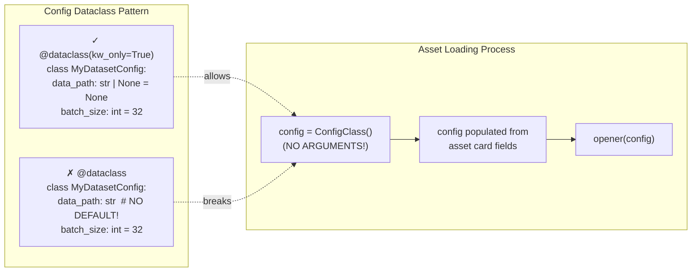

---
myst:
  html_meta:
    "description lang=en": "fairseq2 Model Families"
    "keywords": "fairseq2, models, documentation"
---

# Model Families


## Purpose and Scope

This document describes the **family-based organization system** for models, tokenizers, and datasets in fairseq2. The family abstraction provides a uniform interface for loading, configuring, and instantiating these assets from asset cards while supporting features like distributed loading, state dict conversion, and FSDP application.

For information about the asset card system and asset store that families use, see fairseq2 Asset Management. For details on the Gang system used during distributed loading, see fairseq2 Gang System. For checkpoint loading mechanics, see fairseq2 Checkpoint Management. For model abstractions, see fairseq2 Model Abstractions. For specific implementations, see fairseq2 Language Models and fairseq2 Speech Models.

---

## Family Abstraction Overview

The family system organizes related models, tokenizers, and datasets into named families. Each family:

* **Manages configurations**: Supports multiple architectures and custom configurations
* **Handles loading**: Downloads checkpoints, loads state dicts, and handles distributed synchronization
* **Provides factories**: Creates instances from configurations
* **Supports features**: FSDP, compilation, tensor parallelism, activation checkpointing

The system includes three parallel family types:

| Family Type | Base Class | Purpose | Example Families |
| --- | --- | --- | --- |
| Model | `ModelFamily` | Neural network models | `llama`, `mistral`, `wav2vec2` |
| Tokenizer | `TokenizerFamily` | Text tokenizers | `llama`, `nllb`, `s2t_transformer` |
| Dataset | `DatasetFamily` | Dataset loaders | `generic_speech`, `instruction` |

Sources: src/fairseq2/models/family.py72-167 src/fairseq2/data/tokenizers/family.py33-58 src/fairseq2/datasets/family.py27-48

---

## Family Class Hierarchy

**Figure 1: Family System Architecture**

The architecture uses protocol types for extensibility. Each family implementation composes various protocols (factory, loader, converter) that define specific behaviors, allowing families to support different model types while maintaining a uniform interface.

Sources: src/fairseq2/models/family.py259-288 src/fairseq2/data/tokenizers/family.py155-157 src/fairseq2/datasets/family.py134-136

---

## ModelFamily Interface

The `ModelFamily` abstract base class defines the contract for all model families.

### Core Methods

| Method | Purpose | Returns |
| --- | --- | --- |
| `get_archs()` | List supported architectures | `set[str]` |
| `maybe_get_arch_config(arch)` | Get config for architecture | `object | None` |
| `get_model_config(card)` | Extract config from asset card | `object` |
| `create_new_model(config, gangs, dtype, meta, init_rank0_only)` | Create new model instance | `Module` |
| `load_model(card, gangs, dtype, config, load_rank0_only, mmap)` | Load model from checkpoint | `Module` |
| `load_custom_model(path, config, gangs, dtype, load_rank0_only, mmap, restrict)` | Load from custom path | `Module` |
| `iter_checkpoint(path, config, gangs, mmap, restrict)` | Iterate checkpoint tensors | `Iterator[tuple[str, Tensor]]` |
| `compile(model, *args, **kwargs)` | Apply torch.compile | `None` |
| `apply_fsdp(model, granularity, wrapper)` | Apply FSDP wrapping | `Module` |
| `apply_layerwise_ac(model, every_nth_layer)` | Apply activation checkpointing | `Module` |

### Properties

| Property | Type | Purpose |
| --- | --- | --- |
| `name` | `str` | Family name for registration |
| `kls` | `type[Module]` | Model class type |
| `config_kls` | `type[object]` | Configuration class type |
| `supports_meta` | `bool` | Whether meta device initialization is supported |
| `supports_compilation` | `bool` | Whether torch.compile is supported |
| `supports_fsdp` | `bool` | Whether FSDP is supported |
| `supports_layerwise_ac` | `bool` | Whether layerwise activation checkpointing is supported |

Sources: src/fairseq2/models/family.py72-167

---

## StandardModelFamily Implementation

`StandardModelFamily` is the primary implementation of `ModelFamily`, providing a complete feature set for model management.

### Constructor Parameters

**Figure 2: StandardModelFamily Dependencies**

Sources: src/fairseq2/models/family.py302-352

### Configuration Resolution

Configuration resolution follows a hierarchical override system:

**Figure 3: Model Configuration Resolution Flow**

The system checks three configuration keys in order: `model_config_overrides`, `model_config_override`, `model_config`. The first present key's value is merged with the base configuration (either default or architecture-specific).

Sources: src/fairseq2/models/family.py364-401

### Model Creation Pipeline

The `create_new_model()` method handles initialization with optional meta device support and rank-specific behavior:

**Figure 4: Model Creation with Distributed Synchronization**

Key behaviors:

* **Rank 0**: Always creates model on target device (meta or real)
* **Other ranks**: Create on meta device if supported to avoid redundant initialization
* **Broadcasting**: If `init_rank0_only=False` and meta is supported, parameters are broadcast from rank 0
* **Barriers**: Ensure all ranks synchronize before and after broadcasting

Sources: src/fairseq2/models/family.py403-443

### Model Loading Pipeline

The `load_model()` method orchestrates checkpoint download, loading, and distributed synchronization:

**Figure 5: Model Loading and Checkpoint Restoration**

The pipeline handles:

1. **Gated models**: Checks for `checkpoint` field; raises `ModelGatedError` if missing
2. **Download**: Rank 0 downloads, others wait at barrier
3. **Path resolution**: Handles `checkpoint_path` sub-path specification
4. **Rank-specific loading**: Only rank 0 loads checkpoint to avoid redundant I/O
5. **Broadcasting**: Optionally distributes parameters to all ranks
6. **Buffer initialization**: Non-persistent buffers not in checkpoint are explicitly reset

Sources: src/fairseq2/models/family.py445-605

### Checkpoint Iteration

The `iter_checkpoint()` method provides lazy loading of checkpoint tensors with sharding support:

**Figure 6: Checkpoint Iteration with Shard Dimension Extraction**

The method:

Sources: src/fairseq2/models/family.py621-693

---

## TokenizerFamily Interface and Implementation

`TokenizerFamily` follows a similar pattern to `ModelFamily` but is simpler since tokenizers don't require distributed loading or FSDP support.

### Interface

| Method | Purpose | Returns |
| --- | --- | --- |
| `get_tokenizer_config(card)` | Extract config from asset card | `object` |
| `load_tokenizer(card, gangs, config)` | Load tokenizer from card | `Tokenizer` |
| `load_custom_tokenizer(path, config, gangs)` | Load from custom path | `Tokenizer` |

### StandardTokenizerFamily

The `StandardTokenizerFamily` implementation handles tokenizer loading with similar configuration resolution but simpler loading logic:

**Figure 7: Tokenizer Loading Sequence**

Unlike models, tokenizers:

Sources: src/fairseq2/data/tokenizers/family.py164-330

---

## DatasetFamily Interface and Implementation

`DatasetFamily` provides a minimal interface for dataset loading without distributed coordination.

### Interface

| Method | Purpose | Returns |
| --- | --- | --- |
| `get_dataset_config(card)` | Extract config from asset card | `object` |
| `open_dataset(card, config)` | Open dataset from card | `object` |
| `open_custom_dataset(config)` | Open dataset from custom config | `object` |

### StandardDatasetFamily

`StandardDatasetFamily` is the simplest family implementation, delegating to a `DatasetOpener` protocol:

Sources: src/fairseq2/datasets/family.py143-225

### Configuration Dataclass Requirements

**CRITICAL**: All configuration dataclasses (for models, tokenizers, and datasets) **MUST have defaults for all fields**.



**Why this is required:**

The `StandardDatasetFamily` (and all family implementations) call `config_kls()` with **NO arguments** (line 93 of src/fairseq2/datasets/family.py):

```python
try:
    base_config = self._config_kls()  # ❌ Fails if any field lacks default
except TypeError as ex:
    raise InternalError(
        f"Default configuration of the {self._name} dataset family cannot be constructed."
    ) from ex
```

After creating the default config, fairseq2 populates fields from the asset card's `dataset_config` section.

**Correct Pattern:**

```python
from dataclasses import dataclass

@dataclass(kw_only=True)
class MyDatasetConfig:
    """Configuration for custom dataset.

    All fields MUST have defaults because fairseq2 instantiates
    this with no arguments, then populates from asset cards.
    """
    data_path: str | None = None  # ✓ Will be set from asset card
    manifest_dir: str | None = None  # ✓ Optional field
    batch_size: int = 32  # ✓ Has sensible default
    shuffle: bool = True  # ✓ Has sensible default
```

**See fairseq2-extension (§ Dataset Implementation Pattern) for complete dataset implementation examples.**

---

## Family Registration and Discovery

Families are registered with the dependency injection system and discovered via asset card metadata.

### Registration

Each family implementation is registered as a dependency with a unique name:

### Discovery from Asset Cards

When loading an asset, the system extracts the family name from the card and resolves it:

**Figure 8: Family Discovery from Asset Card**

Sources: src/fairseq2/models/family.py229-242 src/fairseq2/data/tokenizers/family.py127-140 src/fairseq2/datasets/family.py104-117

### Helper Functions

Each family type provides helper functions for name extraction:

| Function | Purpose | Returns |
| --- | --- | --- |
| `get_model_family_name(card)` | Get model family name | `str` |
| `maybe_get_model_family_name(card)` | Get model family name or None | `str | None` |
| `get_tokenizer_family_name(card)` | Get tokenizer family name | `str` |
| `maybe_get_tokenizer_family_name(card)` | Get tokenizer family name or None | `str | None` |
| `get_dataset_family_name(card)` | Get dataset family name | `str` |
| `maybe_get_dataset_family_name(card)` | Get dataset family name or None | `str | None` |

The `maybe_*` variants return `None` instead of raising `AssetCardNotValidError` when the family field is missing.

Sources: src/fairseq2/models/family.py179-226 src/fairseq2/data/tokenizers/family.py77-125 src/fairseq2/datasets/family.py54-101

---

## Asset Card Integration

Families extract all necessary information from asset cards using a standardized field structure.

### Model Asset Card Fields

**Figure 9: Model Asset Card Field Structure**

Sources: src/fairseq2/models/family.py365-401 src/fairseq2/models/family.py465-510

### Tokenizer Asset Card Fields

| Field | Type | Required | Purpose |
| --- | --- | --- | --- |
| `tokenizer_family` | `str` | Yes | Family name |
| `tokenizer` | `URI` | Yes | Tokenizer file/directory location |
| `tokenizer_config` | `dict` | No | Config overrides |
| `tokenizer_config_override` | `dict` | No | Alternative override key |
| `tokenizer_config_overrides` | `dict` | No | Alternative override key |
| `tokenizer_path` | `str` | No | Sub-path within tokenizer directory |
| `url` | `str` | No | Info URL for gated tokenizers |

Sources: src/fairseq2/data/tokenizers/family.py195-269

### Dataset Asset Card Fields

| Field | Type | Required | Purpose |
| --- | --- | --- | --- |
| `dataset_family` | `str` | Yes | Family name |
| `dataset_config` | `dict` | No | Config overrides |
| `dataset_config_override` | `dict` | No | Alternative override key |
| `dataset_config_overrides` | `dict` | No | Alternative override key |

Sources: src/fairseq2/datasets/family.py168-191

---

## Configuration Precedence

All family types use the same configuration override precedence:

**Figure 10: Configuration Override Precedence**

Where `{type}` is `model`, `tokenizer`, or `dataset`. The first present override key is used; subsequent keys are ignored.

Sources: src/fairseq2/models/family.py303-307 src/fairseq2/data/tokenizers/family.py166-170 src/fairseq2/datasets/family.py145-149

---

## Error Handling

The family system defines specific exceptions for common failure modes:

### Model-Specific Errors

| Exception | Raised When |
| --- | --- |
| `ModelFamilyNotKnownError` | Requested family name not registered |
| `ModelGatedError` | Asset card missing checkpoint field (gated model) |
| `AssetCardError` | Asset card fields invalid or inconsistent |
| `CorruptModelCheckpointError` | Checkpoint file corrupted or incompatible |
| `ModelCheckpointMismatchError` | Checkpoint state doesn't match model structure |

Sources: src/fairseq2/models/family.py169-177 src/fairseq2/models/family.py245-251

### Tokenizer-Specific Errors

| Exception | Raised When |
| --- | --- |
| `TokenizerFamilyNotKnownError` | Requested family name not registered |
| `TokenizerGatedError` | Asset card missing tokenizer field (gated tokenizer) |
| `TokenizerModelError` | Tokenizer file corrupted or invalid |

Sources: src/fairseq2/data/tokenizers/family.py60-75 src/fairseq2/data/tokenizers/family.py143-149

### Dataset-Specific Errors

| Exception | Raised When |
| --- | --- |
| `DatasetFamilyNotKnownError` | Requested family name not registered |
| `DatasetError` | Generic dataset opening error |

Sources: src/fairseq2/datasets/family.py50-51 src/fairseq2/datasets/family.py120-126

---

## Protocol Types and Extensibility

The family system uses protocol types to enable composition and extensibility without inheritance:

### Model Protocols

These protocols allow different model families to provide specialized implementations while maintaining type safety through contravariance (`_contra`) and covariance (`_co`) annotations.

Sources: src/fairseq2/models/family.py259-288

### Tokenizer and Dataset Protocols

Sources: src/fairseq2/data/tokenizers/family.py155-157 src/fairseq2/datasets/family.py134-136

---

## Integration with Hub System

While families handle the mechanics of loading, the **Hub** system provides user-facing APIs that delegate to families. This separation allows integration with recipes and the training system.

For details on the Hub layer, see fairseq2 Model Abstractions and fairseq2 Tokenization.

Sources: src/fairseq2/models/\_\_init\_\_.py26-33 src/fairseq2/data/tokenizers/\_\_init\_\_.py28-34 src/fairseq2/datasets/\_\_init\_\_.py29-31


