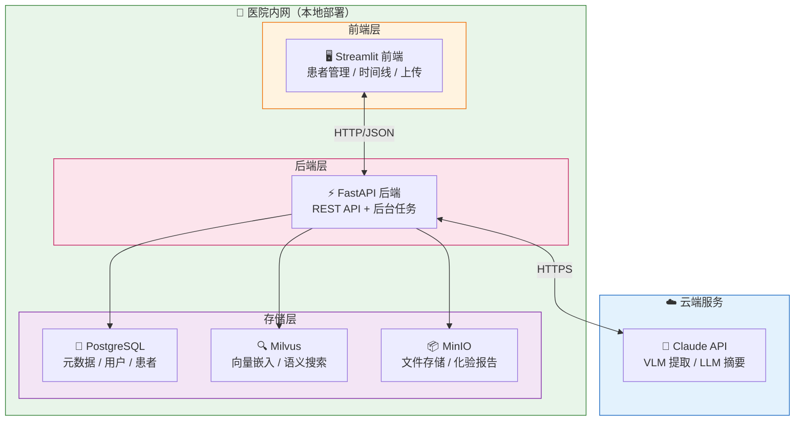
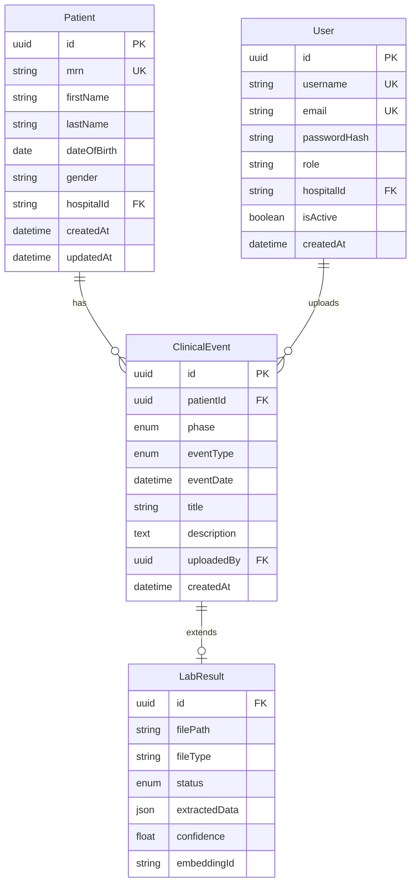
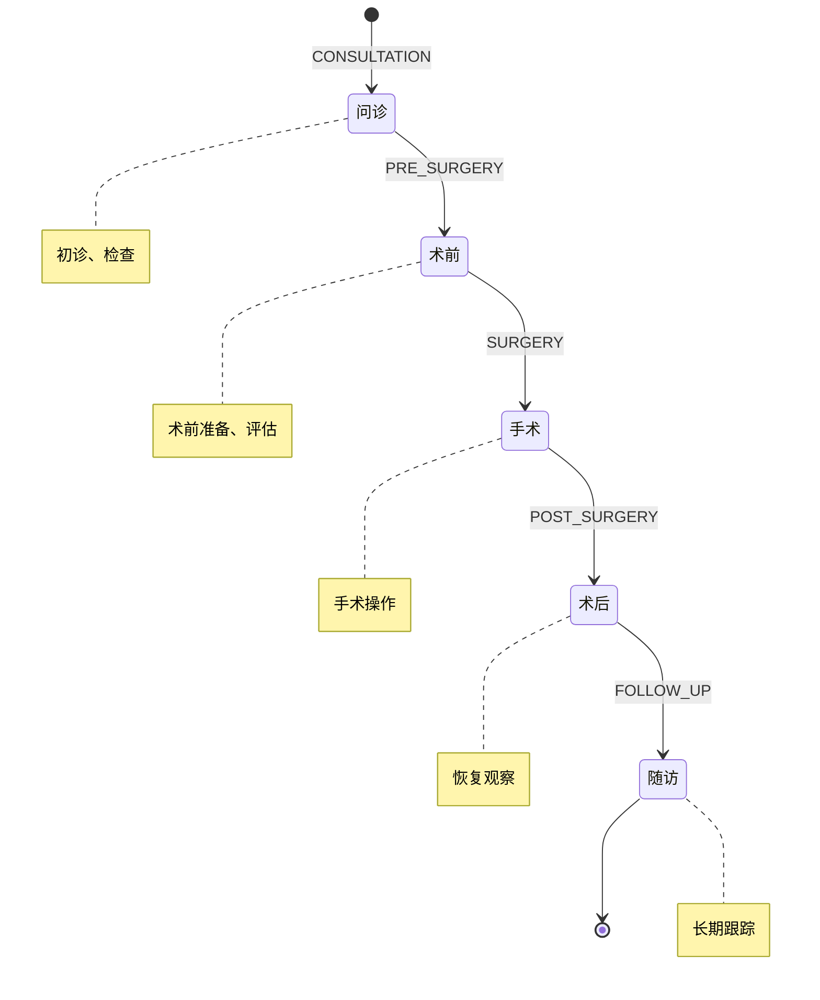
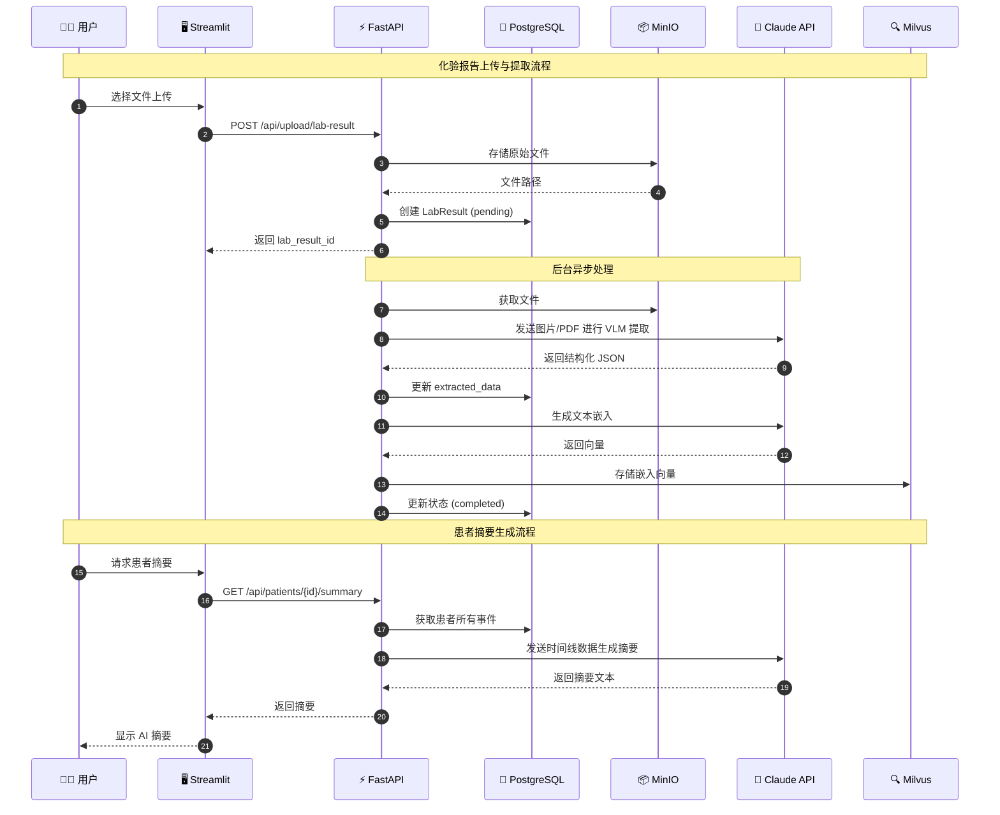
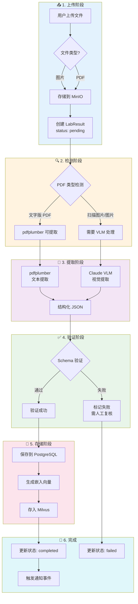
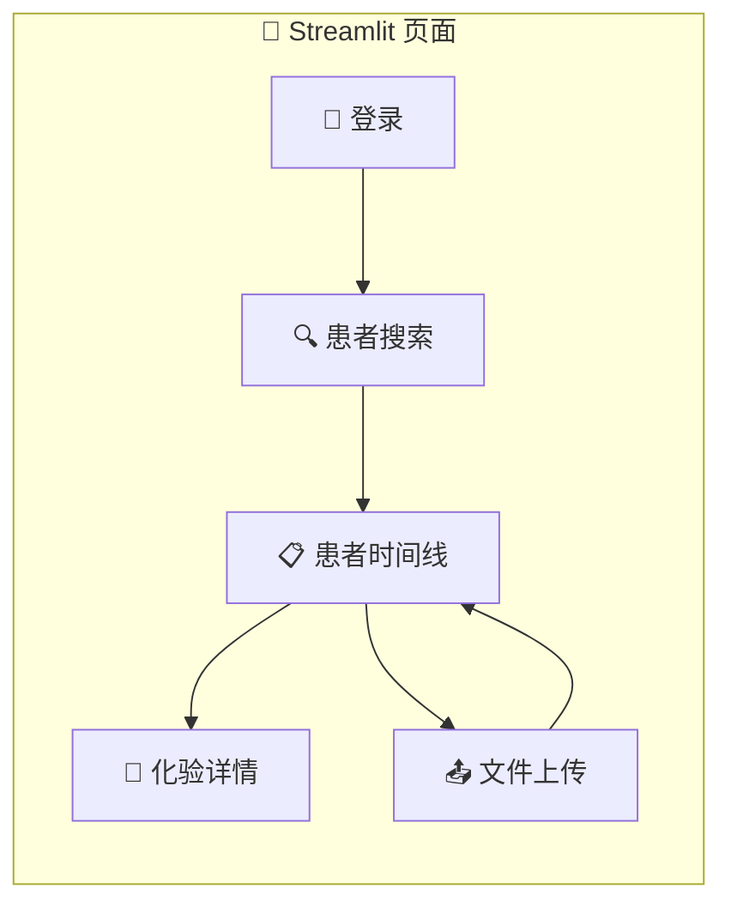
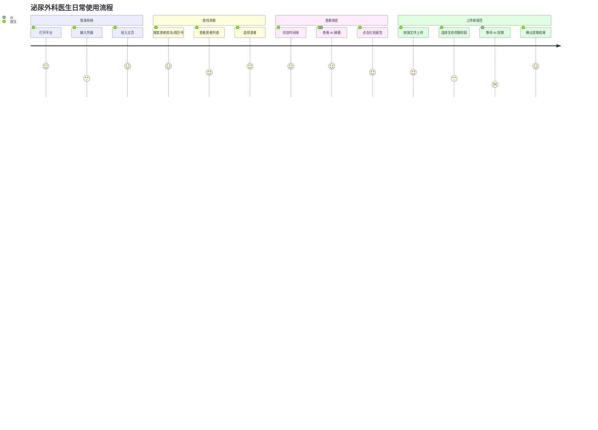
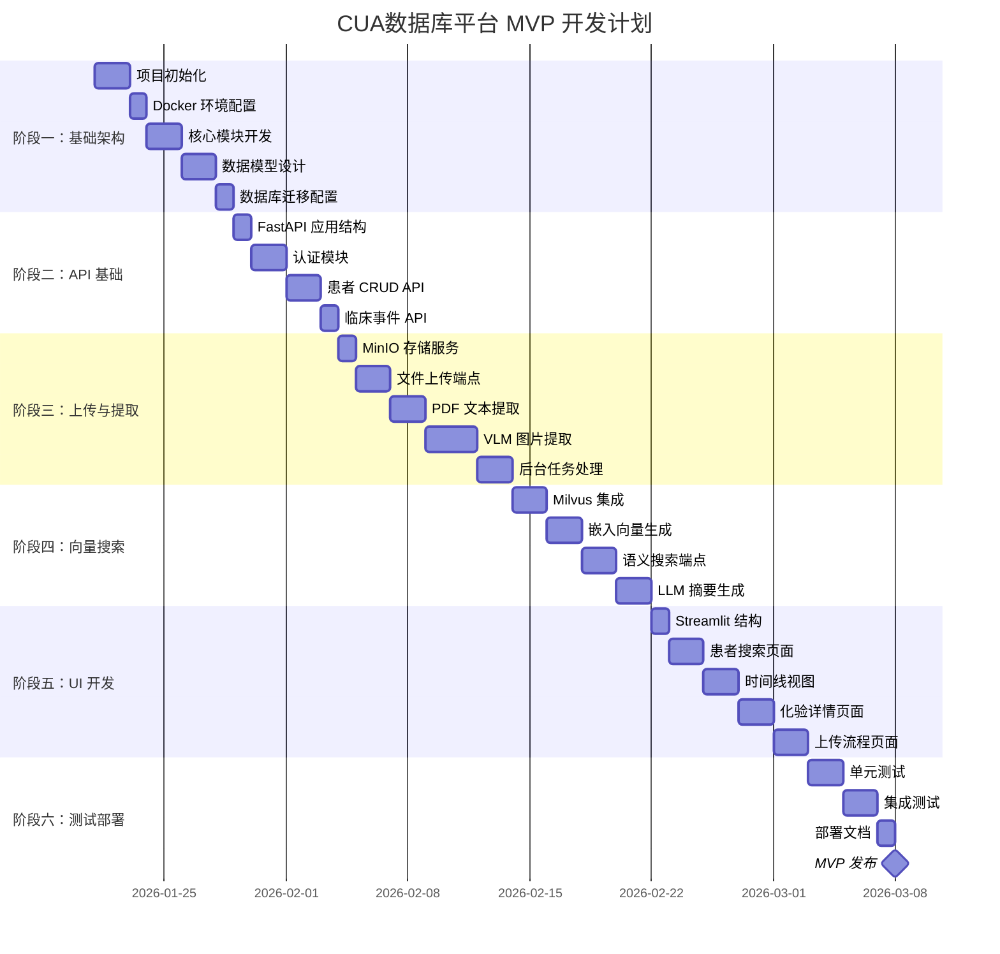
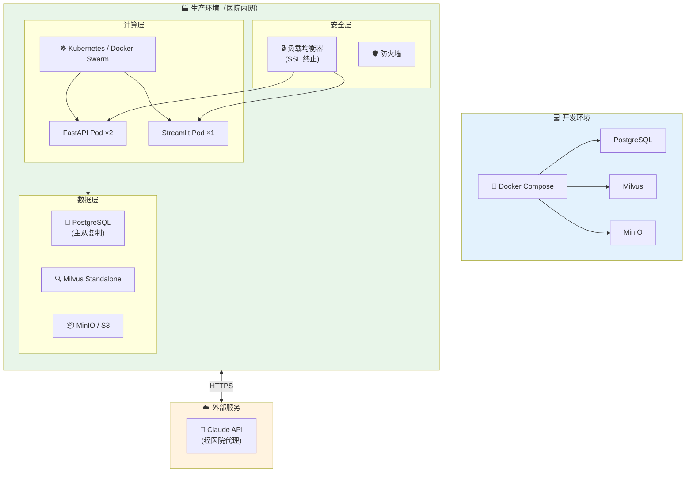
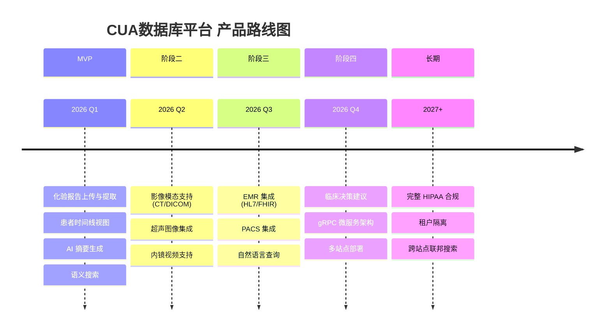

# CUA数据库平台 - 设计与实施计划

## 概述

为泌尿外科医生打造的统一患者数据平台，聚合多模态医疗数据（首先从化验报告开始），并利用 AI 进行提取和摘要生成。

**核心问题**：泌尿外科医生需要花费大量时间从分散的系统中拼凑患者病史信息。

**解决方案**：统一的患者时间线视图，结合 AI 驱动的提取和摘要功能。

---

## MVP 范围

- **主要用户**：泌尿外科医生/外科医生
- **部署方式**：混合部署（本地数据，云端 AI）
- **规模**：1 家试点医院，1-5 名用户
- **合规性**：基础安全（认证 + 加密），正式合规推迟

### 功能

1. 手动上传化验报告（扫描图片 + 数字化 PDF）
2. VLM/OCR 提取为结构化 JSON
3. 按生命周期阶段组织的患者时间线视图
4. LLM 驱动的患者摘要生成
5. 跨患者记录的语义搜索

### MVP 范围外

- CT/超声/内镜支持
- EMR/PACS 集成
- 临床建议
- 多站点部署
- 完整 HIPAA 合规

---

## 系统架构



---

## 数据模型

### 实体关系图



### 字段说明

| 实体 | 关键字段 | 说明 |
|------|----------|------|
| **Patient** | `mrn` | 病历号（唯一） |
| | `hospital_id` | 所属医院 |
| **User** | `role` | 角色：urologist / nurse / admin |
| **ClinicalEvent** | `phase` | 生命周期阶段 |
| | `event_type` | 事件类型：化验报告、影像、手术、笔记 |
| **LabResult** | `file_type` | 文件类型：image / pdf |
| | `extraction_status` | 状态：pending / processing / completed / failed |

### 生命周期阶段



---

## API 设计（REST）

| 方法 | 端点 | 描述 |
|------|------|------|
| `POST` | `/api/auth/login` | JWT 认证登录 |
| `POST` | `/api/patients` | 创建患者 |
| `GET` | `/api/patients/{id}` | 获取患者详情 |
| `GET` | `/api/patients/{id}/timeline` | 获取患者临床事件时间线 |
| `GET` | `/api/patients/{id}/summary` | 获取 LLM 生成的摘要 |
| `POST` | `/api/upload/lab-result` | 上传化验报告（multipart） |
| `GET` | `/api/lab-results/{id}` | 获取提取的化验数据 |
| `POST` | `/api/lab-results/{id}/reprocess` | 重新运行提取 |
| `GET` | `/api/search` | 语义搜索 |

### API 调用时序图



---

## 化验报告处理流程



### 处理流程摘要

| 步骤 | 操作 | 工具/服务 |
|------|------|-----------|
| 上传 | 存储原始文件，创建 `pending` 状态 | MinIO, PostgreSQL |
| 检测 | 判断 PDF 是文字版还是扫描图片 | pdfplumber |
| 提取 | 文字 PDF 用 pdfplumber，图片用 VLM | pdfplumber, Claude |
| 验证 | 根据 Schema 验证提取的 JSON | Pydantic |
| 存储 | 保存结构化数据，生成嵌入向量 | PostgreSQL, Milvus |
| 事件 | 触发下游处理，更新状态 | FastAPI Events |

---

## UI 界面（Streamlit）

### 页面结构



### 用户操作流程



### 界面功能

| 页面 | 功能 | 关键组件 |
|------|------|----------|
| **患者搜索** | 搜索、筛选、快速预览 | 搜索框、筛选器、患者卡片 |
| **患者时间线** | 按生命周期的垂直时间线 | 时间线组件、AI 摘要面板 |
| **化验详情** | 原始文件与提取数据对比 | 并排显示、趋势图表 |
| **文件上传** | 拖放上传、状态追踪 | 上传区域、进度条、阶段选择 |

---

## 技术栈

| 组件 | 技术选型 |
|------|----------|
| 后端 | FastAPI |
| 数据库 | PostgreSQL + SQLAlchemy |
| 向量数据库 | Milvus |
| 文件存储 | MinIO (开发) / S3 (生产) |
| UI | Streamlit |
| VLM/LLM | Claude (claude-3-5-sonnet) |
| PDF 提取 | pdfplumber |
| 嵌入向量 | OpenAI/Voyage Medical |
| 认证 | JWT + python-jose |
| 后台任务 | FastAPI BackgroundTasks |
| 开发环境 | Docker Compose |

---

## 项目结构

```
urology-data-platform/
├── pyproject.toml
├── docker-compose.yml
├── src/
│   ├── main.py                 # FastAPI 入口
│   ├── api/                    # 路由（patients, events, upload, search, auth）
│   ├── models/                 # SQLAlchemy 模型
│   ├── schemas/                # Pydantic 模式
│   ├── services/               # 业务逻辑
│   │   ├── extraction/         # PDF + VLM 提取
│   │   ├── embedding.py        # Milvus 操作
│   │   ├── summary.py          # LLM 摘要
│   │   └── storage.py          # 文件存储
│   ├── core/                   # 配置、安全、数据库
│   └── workers/                # 后台任务
├── ui/                         # Streamlit 应用
│   ├── app.py
│   ├── pages/
│   └── components/
└── tests/
```

---

## 实施计划

### 项目里程碑



### 阶段详情

| 阶段 | 任务 | 产出 |
|------|------|------|
| **一：基础架构** | 项目初始化、Docker 配置、核心模块、数据模型、Alembic | pyproject.toml, docker-compose.yml, models/ |
| **二：API 基础** | FastAPI 结构、认证、患者 CRUD、临床事件 API | api/, schemas/, JWT 认证 |
| **三：上传与提取** | MinIO 服务、上传端点、PDF/VLM 提取、后台任务 | services/extraction/, workers/ |
| **四：向量搜索** | Milvus 集成、嵌入生成、语义搜索、LLM 摘要 | services/embedding.py, summary.py |
| **五：UI 开发** | Streamlit 页面、搜索、时间线、详情、上传 | ui/pages/, ui/components/ |
| **六：测试部署** | 单元测试、集成测试、部署文档 | tests/, docs/ |

---

## 部署架构



---

## 验证

### 本地开发

```bash
# 启动基础设施
docker-compose up -d

# 运行后端
uvicorn src.main:app --reload

# 运行 Streamlit
streamlit run ui/app.py
```

### 测试清单

1. 通过 API 或 UI 创建患者
2. 上传化验报告图片（血液检测照片）
3. 验证提取完成并在时间线中显示数据
4. 上传 PDF 化验报告
5. 验证提取完成
6. 查看患者摘要（LLM 生成）
7. 按化验值搜索患者
8. 查看特定检测的趋势图（如 PSA）

---

## 未来阶段（MVP 后）



### 功能演进

| 阶段 | 核心功能 | 技术要点 |
|------|----------|----------|
| **MVP** | 化验报告、时间线、AI 摘要 | VLM 提取、LLM 摘要、向量搜索 |
| **阶段二** | 影像模态扩展 | DICOM 解析、视频处理 |
| **阶段三** | 系统集成 | HL7/FHIR 适配器、PACS 连接 |
| **阶段四** | 智能决策 | 临床建议、微服务化 |
| **长期** | 企业级部署 | 多租户、合规认证 |
